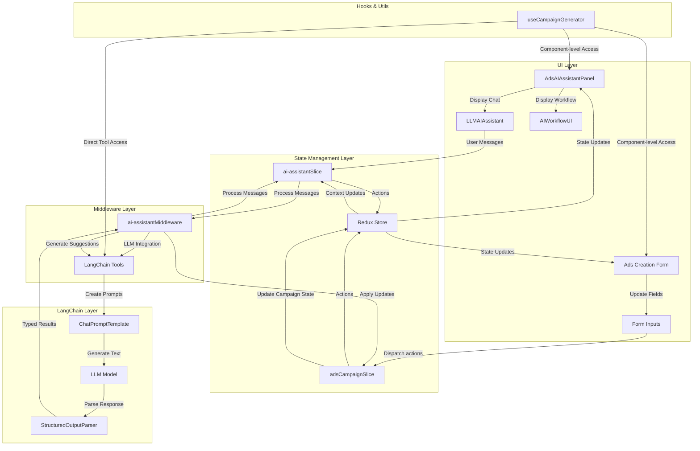
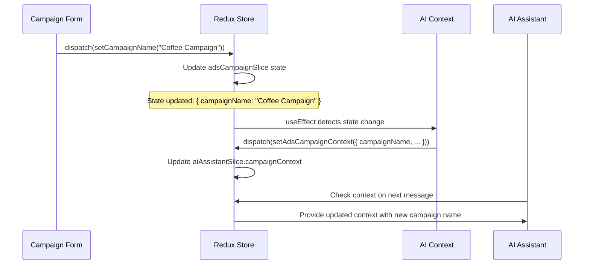
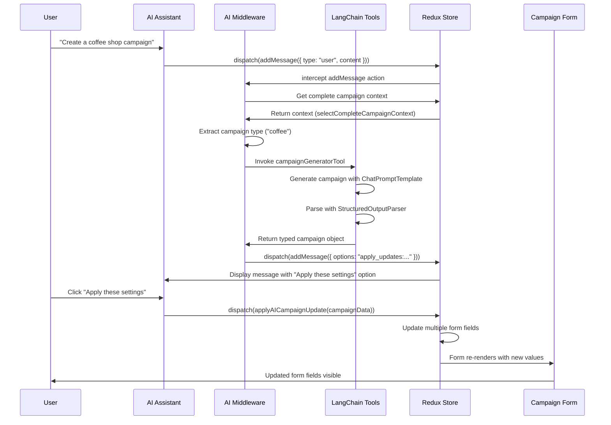

# Ad Campaign Creation with LangChain + Redux

This document explains the architecture and implementation of the AI-powered ad campaign creation feature, which leverages LangChain for natural language processing and Redux for state management.

## Architecture Overview

The ad campaign creation feature uses a bidirectional flow between the form UI and AI assistant:

1. **Form → AI**: Updates to form fields are sent to the AI context
2. **AI → Form**: AI suggestions update the form fields

This is accomplished through several key components working together in a reactive architecture:



## Detailed Implementation Overview

### 1. Redux Implementation

The Redux implementation consists of two primary slices that work together to enable bidirectional flow:

#### State Management

- **`adsCampaignSlice.ts`**:
  - Stores campaign form data including name, description, merchant info, targeting
  - Defines actions for form updates (e.g., `setCampaignName`, `addLocation`)
  - Implements special `applyAICampaignUpdate` action for AI updates
  - Handles UI states like `isGenerating` and `lastGenerated`

```typescript
// Key implementation in adsCampaignSlice.ts
export const applyAICampaignUpdate = createAction<{
  merchantId?: string;
  merchantName?: string;
  // other fields...
}>("adsCampaign/applyAICampaignUpdate");

// In extraReducers:
builder.addCase(applyAICampaignUpdate, (state, action) => {
  // Apply AI suggestions to form state
  if (action.payload.campaignName)
    state.campaignName = action.payload.campaignName;
  // Apply other fields...
});
```

- **`ai-assistantSlice.ts`**:
  - Manages chat history, messages, and options
  - Stores context information for current feature (`adsCampaignContext`)
  - Handles processing states and error conditions
  - Provides actions for AI interaction (`addMessage`, `setAdsCampaignContext`)

```typescript
// Key implementation in ai-assistantSlice.ts
setAdsCampaignContext: (
  state,
  action: PayloadAction<CampaignContext>
) => {
  state.contextId = "adsCampaignContext";
  state.systemPrompt = SYSTEM_PROMPTS.CAMPAIGN_ASSISTANT;
  state.campaignContext = action.payload;
},
```

#### Selectors

- **`adsCampaignSelectors.ts`**:
  - Individual field selectors (`selectCampaignName`, `selectMediaTypes`, etc.)
  - Computed selectors for derived states (`selectHasRequiredBasicInfo`)
  - Context selector for AI (`selectCompleteCampaignContext`)

```typescript
// Context selector implementation
export const selectCompleteCampaignContext = createSelector(
  [
    selectMerchantId,
    selectCampaignName,
    // other selectors...
    (state: RootState) => state.aiAssistant.messages
  ],
  (merchantId, campaignName, /* other fields */, messages) => {
    return {
      merchantId,
      campaignName,
      // other fields...
      conversationHistory: messages,
    };
  }
);
```

### 2. LangChain Integration

The LangChain integration uses structured tools with typed outputs for reliable AI interactions:

#### Tools Implementation

- **`createCampaignGeneratorTool()`**:
  - Takes campaign type, description, and current context as input
  - Uses Zod for typed output schema definition
  - Processes through LangChain's templating and model pipeline
  - Returns fully structured campaign data

```typescript
const campaignSchema = z.object({
  merchantId: z.string().optional(),
  merchantName: z.string(),
  campaignName: z.string(),
  // other fields...
});

const campaignParser = StructuredOutputParser.fromZodSchema(campaignSchema);

const promptTemplate = ChatPromptTemplate.fromTemplate(`
  Generate a comprehensive advertising campaign based on the following information:
  
  Campaign Type: {campaignType}
  User Description: {description}
  
  ${contextString}
  
  ${escapedFormatInstructions}
  
  // Additional instructions...
`);

const chain = promptTemplate.pipe(model).pipe(campaignParser);
```

- **`createCampaignAnalysisTool()`**:
  - Analyzes existing campaigns for effectiveness
  - Provides structured feedback with strengths/weaknesses
  - Includes numeric ratings for key performance indicators

#### Middleware Processing Flow

The `ai-assistantMiddleware.ts` ties everything together:

1. **Message Interception**:

   - Intercepts user messages and magic generate actions
   - Identifies context (adsCampaignContext vs. productFilterContext)
   - Routes to appropriate processor

2. **Context Extraction**:

   - Pulls complete campaign context from Redux state
   - Extracts campaign type from message using NLP patterns
   - Prepares input for LangChain tools

3. **Tool Invocation**:

   - Calls appropriate LangChain tool with context
   - Processes structured response
   - Handles errors with fallback to simulated responses

4. **Response Processing**:
   - Formats response for the UI with appropriate options
   - Provides `apply_updates` option with serialized JSON
   - Adds system messages for success/failure feedback

```typescript
// Example middleware implementation for adsCampaignContext
if (contextId === "adsCampaignContext") {
  const campaignContext = selectCompleteCampaignContext(state);

  try {
    // Extract campaign type from message
    const campaignType = extractCampaignTypeFromMessage(currentMessage);

    // Call LangChain tool
    const result = await campaignGeneratorTool.invoke(
      JSON.stringify({
        campaignType,
        description: currentMessage,
        currentContext: campaignContext,
      })
    );

    // Process result
    const campaignSuggestion = JSON.parse(result);

    // Send AI response with apply_updates option
    store.dispatch(
      addMessage({
        type: "ai",
        content: `I've generated a campaign based on your request!`,
        responseOptions: [
          {
            text: "Apply these settings",
            value: `apply_updates:${JSON.stringify(campaignSuggestion)}`,
          },
          // other options...
        ],
      })
    );
  } catch (error) {
    // Fallback to simulated response
  }
}
```

### 3. UI Components

The UI layer consists of specialized components for AI interaction:

#### Assistant Panel Implementation

- **`AdsAIAssistantPanel`**:
  - Container component with tabs for chat and workflow
  - Manages context synchronization with `useEffect`
  - Handles option selection and update dispatching
  - Uses `LLMAIAssistant` for chat interface

```typescript
// Update AI assistant context when campaign data changes
useEffect(() => {
  dispatch(
    setAdsCampaignContext({
      merchantId,
      merchantName,
      offerId,
      campaignName,
      campaignDescription,
      startDate,
      endDate,
      campaignWeight,
      mediaTypes,
      locations,
      budget,
    })
  );
}, [
  dispatch,
  merchantId,
  merchantName,
  // other dependencies...
]);
```

- **`LLMAIAssistant`**:
  - Redux-connected chat component
  - Handles message sending and option selection
  - Uses system prompts for contextual awareness
  - Integrates with the magic generate button for one-click campaigns

#### Workflow Components

- **`AIWorkflowUI`**:

  - Visual step-by-step guided workflow
  - Shows progress through campaign creation steps
  - Animated state transitions for active/completed states

- **`useAIWorkflow`**:
  - Custom hook for workflow state management
  - Step progression and completion tracking
  - Error handling and step resets

### 4. Data Flow in Detail

#### Form to AI Flow (Detailed Steps)



#### AI to Form Flow (Detailed Steps)



### 5. Hook-Based Integration

For component-level integration, custom hooks provide direct access to LangChain tools:

```typescript
// Using the useCampaignGenerator hook
function CampaignGenerationComponent() {
  const { generateCampaign, analyzeCampaign, isLoading } = useCampaignGenerator();

  const handleCreateCampaign = async () => {
    // Get campaign type from input or component state
    const campaignType = "coffee";
    const description = "Create a campaign for a new coffee shop in Seattle targeting millennials";

    // Call the hook directly
    const result = await generateCampaign(campaignType, description);

    if (!result.error) {
      // Use the generated campaign data
      console.log("Generated campaign:", result);

      // Get campaign effectiveness analysis
      const analysis = await analyzeCampaign(result);
      console.log("Campaign analysis:", analysis);
    }
  };

  return (
    <div>
      <Button onClick={handleCreateCampaign} disabled={isLoading}>
        Generate Campaign
      </Button>
    </div>
  );
}
```

### 6. System Prompts and LLM Configuration

The system uses well-defined prompts for consistent AI behavior:

```typescript
// From services/ai/index.ts
CAMPAIGN_ASSISTANT: `You are a specialized AI assistant for creating advertising campaigns.
You understand marketing concepts, audience targeting, and ad campaign strategy.

An advertising campaign consists of:
- Basic information (campaign name, description, merchant, offer)
- Campaign dates (start and end dates)
- Media types (display, video, social, etc.)
- Geographic targeting (states, MSAs, zipcodes)
- Budget allocation and cost metrics

You can analyze user inputs about campaign goals and help them create effective campaigns
by suggesting appropriate settings based on best marketing practices.

When users describe a campaign in natural language - for example "create a coffee shop campaign" 
or "I need a retail campaign targeting New York" - you'll interpret their intent and
provide specific suggestions that can be applied directly to their campaign form.

Always make sure to suggest all required fields for a complete campaign, including
locations, media types and budget allocations that make sense for the campaign type.

Common campaign types you should recognize:
1. Coffee/Cafe - Campaigns for coffee shops and cafes
2. Retail - Campaigns for retail stores and shopping
3. Restaurant/Dining - Campaigns for restaurants and food establishments
4. Travel - Campaigns for travel agencies, hotels, and tourism
5. Entertainment - Campaigns for movies, theaters, and events

For each campaign type, provide specific tailored settings based on industry best practices.
Be conversational and helpful, focusing on creating effective campaigns that will drive results.`;
```

## Extension Guidelines

### Adding New Campaign Types

To add support for a new campaign type:

1. Update the `extractCampaignTypeFromMessage` function in the middleware:

```typescript
function extractCampaignTypeFromMessage(message: string): string {
  const messageLC = message.toLowerCase();

  // Add new campaign type patterns
  if (
    messageLC.includes("sports") ||
    messageLC.includes("athletic") ||
    messageLC.includes("fitness")
  ) {
    return "sports";
  }

  // existing types...

  return "general";
}
```

2. Update the `CAMPAIGN_ASSISTANT` system prompt to include the new type
3. Test with various phrasings to ensure reliable detection

### Creating New LangChain Tools

To add a new specialized tool:

1. Create a new tool function in `tools.ts`:

```typescript
export const createCampaignBudgetOptimizerTool = () => {
  return new DynamicTool({
    name: "campaign_budget_optimizer",
    description: "Optimizes campaign budget allocation across media types",
    func: async (input: string) => {
      try {
        const { budget, mediaTypes, goals } = JSON.parse(input);

        // Define Zod schema for the output
        const budgetSchema = z.object({
          allocations: z.array(
            z.object({
              mediaType: z.string(),
              percentage: z.number(),
              amount: z.number(),
            })
          ),
          explanation: z.string(),
          suggestedTotalBudget: z.number().optional(),
        });

        // Create parser and prompt template
        const budgetParser = StructuredOutputParser.fromZodSchema(budgetSchema);
        const formatInstructions = budgetParser.getFormatInstructions();

        // Create and invoke the chain
        const chain = promptTemplate.pipe(model).pipe(budgetParser);
        const response = await chain.invoke({ budget, mediaTypes, goals });

        return JSON.stringify(response);
      } catch (error) {
        // Error handling
        return JSON.stringify({ error: "Failed to optimize budget" });
      }
    },
  });
};
```

2. Add a function to the hook:

```typescript
// Add to useCampaignGenerator hook
const optimizeBudget = useCallback(
  async (budget: number, mediaTypes: string[], goals: string[]) => {
    setIsLoading(true);
    setError(null);

    try {
      const { createCampaignBudgetOptimizerTool } = await import("./tools");
      const tool = createCampaignBudgetOptimizerTool();

      const result = await tool.invoke(
        JSON.stringify({ budget, mediaTypes, goals })
      );
      return JSON.parse(result);
    } catch (err) {
      // Error handling
    } finally {
      setIsLoading(false);
    }
  },
  []
);

// Include in the return value
return {
  generateCampaign,
  analyzeCampaign,
  optimizeBudget,
  isLoading,
  error,
};
```

3. Add middleware support if needed

### Enhancing Workflow Steps

To add or modify workflow steps:

1. Update `defaultCampaignWorkflowSteps` in `AIWorkflowUI.tsx`:

```typescript
export const defaultCampaignWorkflowSteps: WorkflowStep[] = [
  // existing steps...

  // Add new budget optimization step
  {
    id: "optimize-budget",
    title: "Optimize Budget Allocation",
    description: "Maximize ROI by optimizing your budget across channels",
    icon: <BanknotesIcon className="h-5 w-5 text-purple-500" />,
    status: "pending",
    type: "ai"
  },

  // existing steps...
];
```

2. Add handling in the workflow hook:

```typescript
// In useAIWorkflow.ts
const completeCurrentStep = useCallback(() => {
  // existing code...

  // Add specific step handling
  if (currentStep?.id === "optimize-budget") {
    // Use the budget optimizer tool
    const { createCampaignBudgetOptimizerTool } = await import("./tools");
    const tool = createCampaignBudgetOptimizerTool();

    // Get current campaign state
    const budget = 5000; // Get from context
    const mediaTypes = ["Display", "Social"]; // Get from context
    const goals = ["awareness", "traffic"]; // Get from context

    const result = await tool.invoke(
      JSON.stringify({ budget, mediaTypes, goals })
    );

    // Update results and status
    setStepResults((prev) => ({
      ...prev,
      [currentStep.id]: JSON.parse(result),
    }));
    updateStepStatus(currentStep.id, "completed");

    // Move to next step
    setCurrentStepIndex((prevIndex) => prevIndex + 1);
  }

  // existing code...
}, [currentStep, updateStepStatus]);
```

## Fallback Mechanisms

The implementation includes robust fallback mechanisms:

### Error Handling

```typescript
try {
  const result = await campaignGeneratorTool.invoke(toolInput);
  // process result...
} catch (error) {
  console.error("Error processing campaign generator:", error);

  // Log detailed error info for debugging
  console.debug("Tool input that caused error:", toolInput);

  // Fallback to simulated response with error information
  const simResponse = simulateAdsCampaignResponse(
    currentMessage,
    campaignContext
  );
  simResponse.severity = "error";
  simResponse.content = `I encountered an issue creating your campaign. ${error.message}. Let me suggest a basic campaign instead.`;

  // Dispatch fallback response
  store.dispatch(
    addMessage({
      type: "ai",
      content: simResponse.content,
      responseOptions: simResponse.responseOptions,
      severity: simResponse.severity,
    })
  );
}
```

### Simulated Responses

Pre-defined templates based on detected campaign type:

```typescript
function simulateAdsCampaignResponse(
  message: string,
  context: any
): AIResponse {
  const messageLC = message.toLowerCase();

  // Check for coffee campaign request
  if (messageLC.includes("coffee") || messageLC.includes("cafe")) {
    return {
      content: "I can help you create a coffee shop campaign!",
      responseOptions: [
        {
          text: "Generate a coffee campaign",
          value: `apply_updates:${JSON.stringify({
            merchantName: "Coffee Express Inc.",
            campaignName: "Coffee & Treats Special",
            // other fields...
          })}`,
        },
        // other options...
      ],
    };
  }

  // Additional campaign types...

  // Default response
  return {
    content:
      "I'm your campaign assistant. What type of campaign would you like to create?",
    // options...
  };
}
```

## Testing Strategy

The implementation can be tested at multiple levels:

1. **Unit Tests**: For individual tools and hooks
2. **Integration Tests**: For Redux state and middleware
3. **E2E Tests**: For complete user flows

Key test scenarios include:

- Detecting campaign types from various phrasings
- Generating valid campaign structures for all supported types
- Handling error conditions gracefully
- Applying AI updates to form state correctly
- Context synchronization between form and AI
