# AI Product Filter Agent - Technical Architecture

## 📋 Executive Summary

This document provides comprehensive technical architecture documentation for the AI Product Filter Agent system. The system implements a multi-agent AI architecture inspired by enterprise solutions like JP Morgan's AskDavid.

**Quick Navigation**:

- **For Engineers**: [Detailed Technical Diagrams](#-detailed-technical-diagrams) (4 comprehensive diagrams)

---

## 🏗️ Detailed Technical Diagrams

### 1. System Flow & High-Level Architecture

**Complete system overview with user interactions and component relationships**


**Key Integration Points:**

- **User Interface**: React components with real-time state synchronization
- **AI Processing**: LangChain tools orchestrated by supervisor middleware
- **State Management**: Redux with custom middleware for AI workflow processing
- **External Services**: OpenAI for AI processing, Kigo API for data persistence

### 2. Component Architecture & Data Flow

**Detailed component structure, state management, and data flow patterns**

```mermaid
graph LR
    subgraph "🖥️ React Component Tree"
        PFC[ProductFilterCreationView]

        subgraph "AI Assistant Side Panel"
            AIP[AIAssistantPanel]
            LLM[LLMAIAssistant]
            CP[ChatPanel]
            CM[ChatMessage Components]
        end

        subgraph "Filter Form Area"
            FF[FilterForm]
            NF[NameField]
            DF[DescriptionField]
            CL[CriteriaList]
            SB[SubmitButton]
        end
    end

    subgraph "🔄 Redux Architecture"
        Store[Redux Store]

        subgraph "State Slices"
            AIS[AI Assistant Slice<br/>- messages[]<br/>- isProcessing<br/>- currentTool]
            FS[Filter Slice<br/>- filterData<br/>- validationErrors<br/>- coverageStats]
        end

        subgraph "Middleware"
            AIM[AI Assistant Middleware<br/>- Tool routing<br/>- Error handling<br/>- Response caching]
        end
    end

    subgraph "🤖 LangChain Tools"
        FCT[Filter Criteria Tool<br/>- Prompt: criteria generation<br/>- Parser: JSON structure<br/>- Cache: common patterns]

        AFT[Auto Filter Tool<br/>- Prompt: complete filter<br/>- Parser: full filter object<br/>- Validation: required fields]

        NST[Name Suggester Tool<br/>- Prompt: name suggestions<br/>- Parser: string array<br/>- Context: filter criteria]

        FAT[Filter Analyzer Tool<br/>- Prompt: coverage analysis<br/>- Parser: stats object<br/>- API: coverage calculation]
    end

    %% Component relationships
    PFC --> AIP
    PFC --> FF
    AIP --> LLM
    LLM --> CP
    CP --> CM
    FF --> NF
    FF --> DF
    FF --> CL
    FF --> SB

    %% State connections
    LLM <--> AIS
    FF <--> FS
    AIS <--> AIM
    FS <--> AIM
    AIM --> Store

    %% Tool integration
    AIM --> FCT
    AIM --> AFT
    AIM --> NST
    AIM --> FAT

    %% Styling
    style AIM fill:#fff3e0,stroke:#ef6c00,stroke-width:2px
    style Store fill:#e3f2fd,stroke:#1976d2,stroke-width:2px
    style FCT fill:#e8f5e8,stroke:#2e7d32,stroke-width:2px
    style AFT fill:#e8f5e8,stroke:#2e7d32,stroke-width:2px
```

**Data Flow Patterns:**

- **User Input → Redux Action → Middleware → AI Tool → State Update → UI Refresh**
- **Bidirectional Sync**: Chat state ↔ Filter form state in real-time
- **Tool Selection**: Middleware analyzes intent and routes to appropriate tool
- **Response Caching**: Common requests cached to improve performance

### 3. Runtime Behavior & AI Tool Execution

**Conversation flow, tool execution, and real-time interactions**

```mermaid
sequenceDiagram
    participant U as 👤 User
    participant UI as 💬 Chat Interface
    participant MW as 🔄 AI Middleware
    participant CG as 🎯 Conversation Guide
    participant FCT as 🔧 Filter Criteria Tool
    participant OAI as 🤖 OpenAI API
    participant RS as 🗄️ Redux Store
    participant FF as 📝 Filter Form

    Note over U,FF: Complete Conversation Flow with Tool Execution

    %% Initial user input
    U->>UI: "Create restaurant filter for NYC"
    UI->>MW: addMessage(user_input)
    MW->>RS: dispatch(setProcessing: true)

    %% Tool routing and execution
    MW->>CG: invoke({input, context, filterState})
    CG->>CG: Analyze intent: "filter creation"
    CG->>FCT: route to criteria generation

    %% LangChain tool execution
    FCT->>FCT: Build prompt with context
    FCT->>OAI: generateCriteria(prompt)
    OAI-->>FCT: {merchantKeyword: "Restaurant", offerCommodity: "Food", ...}
    FCT->>FCT: Parse and validate output
    FCT-->>CG: return structured suggestions

    %% Response formatting and UI update
    CG-->>MW: {message, filterUpdates, suggestedActions}
    MW->>RS: dispatch(aiResponse + filterUpdate)
    MW->>RS: dispatch(setProcessing: false)
    RS->>UI: update messages state
    RS->>FF: sync form fields

    %% User interaction with suggestions
    UI->>U: "Here are suggestions for your restaurant filter"<br/>[Use This] [Modify] [Skip]
    U->>UI: Click "Use This"
    UI->>MW: handleOptionSelected(option)
    MW->>RS: dispatch(applyFilterUpdate)
    RS->>FF: update form with selected values
    FF-->>U: Show updated filter form

    Note over U,FF: Real-time state synchronization

    %% Magic Generate flow
    U->>UI: Click "Magic Generate"
    UI->>MW: magicGenerate()
    MW->>CG: invoke auto generation tool
    CG->>FCT: generate complete filter
    FCT->>OAI: generate full filter object
    OAI-->>FCT: complete filter with all criteria
    FCT-->>MW: structured filter object
    MW->>RS: dispatch(applyCompleteFilter)
    RS->>FF: populate entire form
    FF-->>U: Show completed filter
```



**Runtime Features:**

- **Context Awareness**: Tools receive conversation history and current filter state
- **Real-time Sync**: State changes immediately reflected in both chat and form
- **Tool Routing**: Middleware intelligently selects appropriate tool based on user intent
- **Error Handling**: Graceful fallback with user notification and progress preservation

### 4. Error Handling & Performance Monitoring

**Comprehensive error handling, fallback strategies, and monitoring architecture**


**Error Handling Features:**

- **Graceful Degradation**: System continues functioning even when AI tools fail
- **Progress Preservation**: User progress never lost during errors
- **Intelligent Retry**: Exponential backoff with circuit breaker pattern
- **User Communication**: Clear error messages with actionable next steps

**Performance Monitoring:**

- **Real-time Metrics**: Response times, success rates, error frequencies
- **Usage Analytics**: Conversation patterns, tool effectiveness, user behavior
- **Optimization Feedback**: Continuous improvement based on monitoring data

## 🎯 Key Architectural Decisions

### **Multi-Agent Pattern**

- **Why**: Inspired by enterprise AI systems like JP Morgan's AskDavid
- **Benefit**: Specialized agents provide better, more focused responses
- **Implementation**: Supervisor routes requests to appropriate specialist tools

### **Redux + AI Middleware**

- **Why**: Seamless integration between conversational AI and traditional forms
- **Benefit**: Real-time synchronization without complex prop drilling
- **Implementation**: Custom middleware processes AI actions and updates state

### **LangChain Integration**

- **Why**: Modular, testable AI tool architecture
- **Benefit**: Easy to extend, debug, and maintain individual AI capabilities
- **Implementation**: Each tool focuses on specific filter creation tasks

## 📊 Current Implementation Status

### ✅ **Completed**

- [x] Multi-agent architecture with supervisor and 4 specialist agents
- [x] Redux state management with AI middleware integration
- [x] LangChain tools for filter criteria generation and analysis
- [x] Real-time chat-to-form synchronization
- [x] Basic error handling with manual fallback

### 🚧 **In Progress**

- [ ] Enhanced conversation context management
- [ ] Performance optimization and response caching
- [ ] Comprehensive error boundaries and retry logic
- [ ] User testing and conversation flow refinement

### 📋 **Planned**

- [ ] Conversation history persistence across sessions
- [ ] Advanced analytics and monitoring dashboard
- [ ] Integration with campaign creation workflow
- [ ] Multi-modal input support (voice, file upload, etc.)

## 🎪 Success Metrics

### **User Experience**

- **🎯 50% reduction** in filter creation time
- **🎯 4.0+ rating** user satisfaction score
- **🎯 85%+ completion** rate for AI-assisted workflows

### **Technical Performance**

- **🎯 <3 seconds** average AI response time
- **🎯 <2% error rate** for core conversation flows
- **🎯 100+ concurrent** users supported

### **Business Impact**

- **🎯 60%+ adoption** of AI-assisted filter creation
- **🎯 30% reduction** in support tickets related to filters

---

## 🛠️ Implementation Notes

### Current State

- ✅ Basic multi-agent architecture implemented
- ✅ Redux state management with middleware
- ✅ LangChain tool integration
- ✅ React component structure
- ⏳ Advanced error handling
- ⏳ Performance monitoring
- ⏳ Conversation history persistence

### Technical Debt

- Need better error boundary implementation
- Tool response caching not implemented
- Limited conversation context management
- No advanced analytics or monitoring

### Future Enhancements

- Implement conversation memory persistence
- Add advanced tool routing logic
- Enhanced error recovery mechanisms
- Real-time performance monitoring dashboard

---

_Document Status_: v2.0 - Consolidated Technical Architecture  
_Last Updated_: [Current Date]  
_Audience_: Engineers, Technical Leads, Solution Architects  
_Related_: [Project Requirements & Implementation](./implementation-plan.md)
