# Kigo AI Agent Architecture - Comprehensive System Design

## 🏗️ Overall Agent Architecture

**Multi-Agent System for Kigo Pro Dashboard - Inspired by Enterprise AI Platforms**

```mermaid
graph TB
    subgraph "👤 User Interface Layer"
        User[Program Manager<br/>Offer Manager<br/>Internal User]
        Chat[Conversational Interface<br/>AI Assistant Panel]
        Form[Product Filter Form<br/>Campaign Builder]
        Dash[Analytics Dashboard<br/>Performance Metrics]
    end

    subgraph "🎯 Agent Orchestration - Kigo Assistant"
        Supervisor[Supervisor Agent<br/>• Orchestrates conversation flow<br/>• Routes to specialized agents<br/>• Maintains context & memory<br/>• Human-in-the-loop coordination]

        subgraph "Specialized Sub-Agents"
            FilterAgent[Product Filter Agent<br/>• Criteria generation<br/>• Auto-complete functionality<br/>• Coverage analysis<br/>• Validation & optimization]

            CampaignAgent[Campaign Agent<br/>• Campaign creation assistance<br/>• Template suggestions<br/>• Performance predictions<br/>• A/B test recommendations]

            AnalyticsAgent[Analytics Agent<br/>• Performance insights<br/>• ROI calculations<br/>• Trend analysis<br/>• Optimization suggestions]

            MerchantAgent[Merchant Assistant<br/>• Account management<br/>• Offer recommendations<br/>• Compliance checking<br/>• Best practice guidance]
        end
    end

    subgraph "🤖 LLM Integration Layer"
        subgraph "AI Processing Pipeline"
            LangChain[LangChain Framework<br/>• Tool orchestration<br/>• Prompt management<br/>• Chain composition<br/>• Memory management]

            Tools[Specialized Tools<br/>• Filter Criteria Tool<br/>• Auto Filter Tool<br/>• Name Suggester Tool<br/>• Coverage Calculator Tool]

            Prompts[Prompt Templates<br/>• Domain-specific prompts<br/>• Few-shot examples<br/>• Context injection<br/>• Response formatting]
        end

        subgraph "LLM Providers"
            OpenAI[OpenAI GPT-4<br/>• Primary reasoning<br/>• Text generation<br/>• Complex analysis]

            Anthropic[Anthropic Claude<br/>• Fallback provider<br/>• Code generation<br/>• Safety checking]
        end
    end

    subgraph "⚡ Application State Layer"
        Redux[Redux Store<br/>• Global state management<br/>• Time-travel debugging<br/>• Predictable updates]

        subgraph "State Slices"
            AISlice[AI Assistant Slice<br/>• Conversation history<br/>• Agent status<br/>• Processing state]

            FilterSlice[Filter Creation Slice<br/>• Form data<br/>• Validation state<br/>• Coverage metrics]

            CampaignSlice[Campaign Slice<br/>• Campaign data<br/>• Performance metrics<br/>• Template library]
        end

        Middleware[AI Middleware<br/>• Action interception<br/>• Agent routing<br/>• Error handling<br/>• Response caching]
    end

    subgraph "📊 Observability & Monitoring"
        subgraph "Recommended: LangSmith Integration"
            LangSmith[LangSmith Platform<br/>• LLM call tracing<br/>• Chain execution monitoring<br/>• Performance analytics<br/>• Cost tracking]

            Traces[Execution Traces<br/>• Agent conversation flows<br/>• Tool usage patterns<br/>• Response quality metrics<br/>• Error tracking]
        end

        subgraph "Application Monitoring"
            Sentry[Sentry Error Tracking<br/>• Frontend error capture<br/>• Performance monitoring<br/>• User session replay]

            Analytics[Usage Analytics<br/>• Feature adoption<br/>• User behavior patterns<br/>• Conversion funnels]
        end
    end

    subgraph "🌐 Kigo Services Integration"
        subgraph "Core Kigo APIs"
            KigoCore[Kigo Core Server<br/>• Authentication<br/>• Authorization<br/>• Business logic]

            FilterAPI[Product Filter API<br/>• Filter CRUD operations<br/>• Coverage calculations<br/>• Validation services]

            CampaignAPI[Campaign Management API<br/>• Campaign lifecycle<br/>• Performance tracking<br/>• Asset management]
        end

        subgraph "Data Sources"
            MOM[MOM Database<br/>• Merchant & Offer data<br/>• Historical performance<br/>• Filter templates]

            Analytics_DB[Analytics Database<br/>• Performance metrics<br/>• User behavior data<br/>• A/B test results]
        end
    end

    %% User Flow
    User --> Chat
    User --> Form
    User --> Dash

    %% Agent Orchestration
    Chat --> Supervisor
    Form --> Supervisor
    Supervisor --> FilterAgent
    Supervisor --> CampaignAgent
    Supervisor --> AnalyticsAgent
    Supervisor --> MerchantAgent

    %% LLM Integration
    FilterAgent --> LangChain
    CampaignAgent --> LangChain
    AnalyticsAgent --> LangChain
    MerchantAgent --> LangChain

    LangChain --> Tools
    LangChain --> Prompts
    LangChain --> OpenAI
    LangChain --> Anthropic

    %% State Management
    Supervisor <--> Middleware
    Middleware <--> Redux
    Redux --> AISlice
    Redux --> FilterSlice
    Redux --> CampaignSlice
    Form <--> FilterSlice
    Chat <--> AISlice

    %% Observability
    LangChain --> LangSmith
    Supervisor --> Traces
    Middleware --> Sentry
    User --> Analytics

    %% Kigo Integration
    FilterAgent --> FilterAPI
    CampaignAgent --> CampaignAPI
    Supervisor --> KigoCore
    FilterAPI --> MOM
    CampaignAPI --> Analytics_DB

    %% Styling
    style Supervisor fill:#e1f5fe,stroke:#0277bd,stroke-width:3px
    style LangSmith fill:#fff3e0,stroke:#ef6c00,stroke-width:2px
    style Redux fill:#e8f5e8,stroke:#2e7d32,stroke-width:2px
    style OpenAI fill:#fce4ec,stroke:#c2185b,stroke-width:2px
    style KigoCore fill:#f3e5f5,stroke:#7b1fa2,stroke-width:2px
```



## 🎯 Key Architectural Decisions

### **1. Multi-Agent Specialization**

- **Product Filter Agent**: Focused on filter creation, criteria generation, and coverage analysis
- **Campaign Agent**: Handles campaign creation and optimization workflows
- **Analytics Agent**: Provides insights and performance recommendations
- **Merchant Agent**: Assists with account management and best practices

### **2. LangSmith Observability (Recommended)**

- **Why LangSmith**: Purpose-built for LLM application monitoring
- **Benefits**:
  - Complete trace visibility for agent conversations
  - Cost tracking across different LLM providers
  - Performance optimization insights
  - Debugging capabilities for complex agent workflows
- **Integration**: Simple SDK integration with LangChain

### **3. Hybrid State Management**

- **Redux**: Global application state and time-travel debugging
- **AI Middleware**: Custom middleware for agent workflow processing
- **Real-time Sync**: Bidirectional chat ↔ form synchronization

### **4. Enterprise Resilience**

- **Multi-Provider LLM**: OpenAI primary, Anthropic fallback
- **Circuit Breakers**: Automatic fallback to manual mode
- **Error Boundaries**: Graceful degradation with user notification
- **Response Caching**: Optimize for common queries and reduce costs

## 📊 Recommended Technology Stack

### **Observability & Monitoring**

```typescript
// LangSmith Integration Example
import { LangSmith } from "langsmith";
import { ChatOpenAI } from "langchain/chat_models/openai";

const langsmith = new LangSmith({
  apiKey: process.env.LANGSMITH_API_KEY,
  projectName: "kigo-product-filter-agent",
});

const llm = new ChatOpenAI({
  modelName: "gpt-4",
  callbacks: [langsmith.getCallback()],
});
```

### **Frontend Monitoring**

```typescript
// Sentry Integration for Error Tracking
import * as Sentry from "@sentry/react";

Sentry.init({
  dsn: process.env.SENTRY_DSN,
  integrations: [new Sentry.BrowserTracing(), new Sentry.Replay()],
  tracesSampleRate: 1.0,
  replaysSessionSampleRate: 0.1,
});
```

### **Performance Monitoring**

```typescript
// Custom Performance Tracking
const trackAgentPerformance = (agentName: string, operation: string) => {
  const startTime = performance.now();

  return {
    end: () => {
      const duration = performance.now() - startTime;
      analytics.track("Agent Performance", {
        agent: agentName,
        operation,
        duration,
        timestamp: new Date().toISOString(),
      });
    },
  };
};
```

## 🔄 Agent Communication Patterns

### **1. Supervisor → Specialist Routing**

```typescript
interface AgentRequest {
  type:
    | "filter_creation"
    | "campaign_assistance"
    | "analytics_query"
    | "merchant_support";
  context: ConversationContext;
  userInput: string;
  formState?: any;
}

const routeToAgent = (request: AgentRequest): Promise<AgentResponse> => {
  switch (request.type) {
    case "filter_creation":
      return filterAgent.process(request);
    case "campaign_assistance":
      return campaignAgent.process(request);
    case "analytics_query":
      return analyticsAgent.process(request);
    case "merchant_support":
      return merchantAgent.process(request);
  }
};
```

### **2. Context Preservation**

```typescript
interface ConversationContext {
  userId: string;
  sessionId: string;
  conversationHistory: Message[];
  currentWorkflow: "filter_creation" | "campaign_builder" | "analytics_review";
  formState: Record<string, any>;
  userProfile: UserProfile;
  recentActions: UserAction[];
}
```

## 🛡️ Security & Compliance

### **Data Privacy**

- **Conversation Encryption**: All AI conversations encrypted in transit and at rest
- **PII Handling**: Automatic detection and masking of sensitive information
- **Audit Logging**: Complete audit trail for compliance requirements
- **Data Retention**: Configurable retention policies for conversation data

### **API Security**

- **Rate Limiting**: Prevent abuse of AI endpoints
- **Authentication**: JWT-based authentication for all AI operations
- **Authorization**: Role-based access to different agent capabilities
- **Input Validation**: Comprehensive validation of user inputs

## 📈 Performance Optimization

### **Response Caching Strategy**

```typescript
interface CacheStrategy {
  // Cache common filter criteria suggestions
  filterCriteria: {
    ttl: "1 hour";
    keyPattern: "filter_suggestions_{merchantType}_{offerCategory}";
  };

  // Cache merchant recommendations
  merchantInsights: {
    ttl: "4 hours";
    keyPattern: "merchant_insights_{merchantId}_{timeRange}";
  };

  // Cache analytics queries
  analyticsQueries: {
    ttl: "30 minutes";
    keyPattern: "analytics_{query_hash}_{date_range}";
  };
}
```

### **Load Balancing**

- **LLM Provider Rotation**: Distribute load across OpenAI and Anthropic
- **Agent Load Distribution**: Queue management for high-demand periods
- **Response Streaming**: Stream agent responses for better perceived performance

## 🚀 Implementation Phases

### **Phase 1: Foundation** ✅

- Multi-agent architecture setup
- Basic LangChain integration
- Redux state management
- Core conversation flows

### **Phase 2: Observability** 🔄

- LangSmith integration for LLM monitoring
- Sentry error tracking setup
- Performance analytics implementation
- Cost tracking and optimization

### **Phase 3: Enhancement** 📋

- Advanced context management
- Multi-session conversation memory
- Predictive analytics integration
- Advanced error recovery mechanisms

---

_This architecture provides enterprise-grade AI agent capabilities while maintaining flexibility for future enhancements and integration with additional Kigo services._
