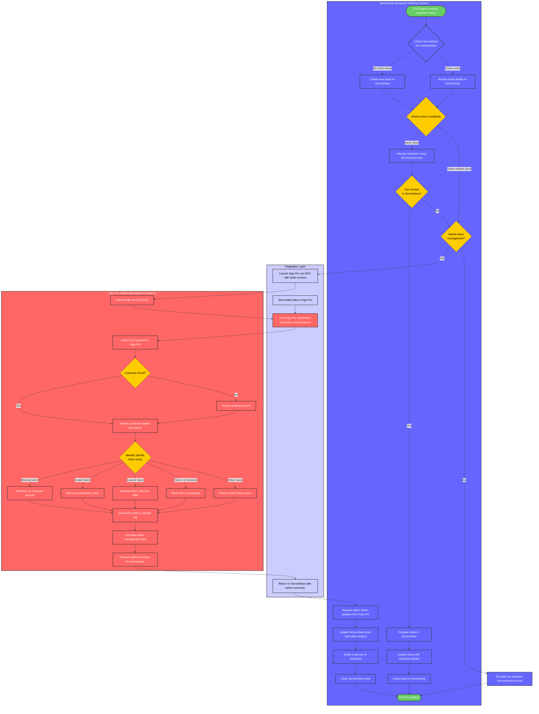

# CVS Token Management System Integration with External Ticketing

## Overview

This document outlines the integration between CVS's primary ticketing system (ServiceNow) and Kigo Pro's token management capabilities. Rather than implementing a full ticketing system within Kigo Pro, this workflow focuses on lightweight integration with existing ticketing platforms, allowing agents to perform specialized token management actions and synchronize the results back to the primary ticketing system.

## User Personas

- **CVS Support Agent**: Primary user who works primarily in ServiceNow but requires Kigo Pro for token management
- **Kigo Pro Administrator**: Manages the integration between systems and ensures proper data flow

## System Integration Context

- **ServiceNow**: Primary ticketing system used by CVS for customer support
- **Kigo Pro**: Specialized token management platform with lightweight ticketing integration
- **Integration Layer**: APIs and SSO mechanisms connecting the two systems

## Detailed User Flow Diagram

## System Boundaries and Integration Points

### ServiceNow (Primary Ticketing System)
- Maintains complete ticket lifecycle management
- Stores all customer communications
- Tracks ticket status, priority, and history
- Serves as the system of record for support cases

### Kigo Pro (Token Management System)
- Provides specialized token management capabilities
- Maintains minimal ticket context (not a full ticketing system)
- Focuses on token actions rather than ticket workflow management
- Logs activities performed on tokens

### Integration Layer
- Single Sign-On (SSO) via Okta allows seamless transition between systems
- Ticket context passed to Kigo Pro through URL parameters or API calls
- Token actions synchronized back to ServiceNow through API endpoints
- Maintains reference IDs between systems for traceability

## Detailed Workflow Description

### 1. Ticket Management in ServiceNow

**Initial Ticket Handling:**
- CVS agent receives customer inquiry via phone, email, or chat
- Agent creates or updates a ticket in ServiceNow with customer information
- Basic customer identification and issue categorization occurs in ServiceNow

**Ticket Triage:**
- Agent reviews ticket details and assesses issue complexity
- For basic issues (account access, general questions), agent resolves directly in ServiceNow
- For token-related issues (missing tokens, expired tokens, token not honored), agent determines Kigo Pro is needed

### 2. Transition to Kigo Pro

**System Handoff:**
- Agent initiates Kigo Pro access through:
  - SSO link within ServiceNow ticket
  - "Manage Tokens" button that passes ticket context via URL parameters
- Ticket information (customer details, issue description, ticket ID) is passed to Kigo Pro
- Kigo Pro shows a persistent "Ticket Context" banner with ServiceNow reference ID

### 3. Token Management in Kigo Pro

**Customer Identification:**
- Agent searches for customer using information from the ticket
- System displays customer profile and token inventory
- If customer doesn't exist, agent can create a new customer record

**Token Actions:**
- Agent performs necessary token management actions:
  - View token details and status
  - Add new tokens from catalog
  - Remove problematic tokens
  - Reissue expired tokens with new dates
  - Mark tokens as disputed
- Each action is logged in Kigo Pro's activity history

**Action Documentation:**
- Agent documents token actions taken
- System captures before/after state of tokens
- Action summary is prepared for synchronization back to ServiceNow

### 4. Return to ServiceNow

**Data Synchronization:**
- Agent completes token management tasks in Kigo Pro
- Agent clicks "Return to ServiceNow" button
- Token actions summary is transferred to ServiceNow via API
- ServiceNow ticket is updated with token management details

**Ticket Resolution:**
- Agent adds any additional notes in ServiceNow
- Agent updates ticket status based on resolution
- Customer is notified of resolution through ServiceNow
- Ticket is closed in ServiceNow when fully resolved

## Integration Touchpoints

### ServiceNow to Kigo Pro
- **Authentication**: SSO via Okta
- **Data Transfer**: Ticket ID, customer information, issue description
- **Context Preservation**: ServiceNow ticket reference displayed in Kigo Pro

### Kigo Pro to ServiceNow
- **Action Summary**: List of token actions taken (add, remove, reissue, etc.)
- **Token Details**: Before/after state of affected tokens
- **Reference IDs**: Links to affected tokens in Kigo Pro

## Minimal Ticketing Elements in Kigo Pro

Instead of implementing a full ticketing system in Kigo Pro, the following minimal elements support the workflow:

1. **Ticket Context Banner**: Persistent UI element showing ServiceNow ticket information
2. **Activity Log**: Record of token actions taken during the session
3. **Action Summary**: Compiled list of changes to synchronize back to ServiceNow
4. **Return Button**: Direct link back to the originating ServiceNow ticket

## Key Decision Points

1. **Token Management Need**: Does the issue require specialized token management capabilities?
2. **Customer Identification**: Can the customer be located in Kigo Pro system?
3. **Action Type**: What specific token manipulation is needed to resolve the issue?
4. **Resolution Status**: Is the issue fully resolved or does it require additional steps?

## Implementation Considerations

1. **API Integration**:
   - ServiceNow API endpoints for ticket updates
   - Kigo Pro API for token action details
   - Webhook notifications for status changes

2. **Authentication Flow**:
   - SSO configuration with proper permissions
   - Session management between systems
   - Security token validation

3. **Data Synchronization**:
   - Real-time vs. batch updates
   - Conflict resolution strategy
   - Fallback mechanisms for connectivity issues

4. **User Experience**:
   - Clear system boundary indicators
   - Consistent UI patterns across systems
   - Minimized context switching

## Success Metrics

- Time spent on token management tasks
- Successful synchronization rate between systems
- Customer resolution satisfaction scores
- Token action volume by category
- System transition time (ServiceNow to Kigo Pro and back) 