# Offer Manager Complete Flow Diagram

## Comprehensive Manual Form Specification

## 🎯 Full System Flow

```mermaid
graph TB
    Start([Start Offer Manager]) --> Dashboard{Entry Point?}

    %% Entry Points
    Dashboard -->|New Offer| Step1[Step 1: Goal & Context]
    Dashboard -->|New Campaign| Step6[Step 6: Offer Selection]
    Dashboard -->|Resume Draft| LoadDraft[Load Draft Data]
    LoadDraft --> ResumeStep[Resume at Last Step]

    %% PHASE 1: OFFER CREATION
    Step1 --> |Program Type Selected| Step1Data

    subgraph Phase1 ["PHASE 1: OFFER CREATION"]
        Step1Data[Collect:<br/>• programType<br/>• targetAudience<br/>• maxDiscount<br/>• totalBudget<br/>• startDate<br/>• endDate]

        Step1Data --> Step2[Step 2: Offer Type & Value]

        Step2 --> OfferTypeSelect{Select Offer Type}

        %% Offer Type Branches
        OfferTypeSelect -->|Percentage| PercentConfig[Value: 1-100%]
        OfferTypeSelect -->|Fixed Discount| FixedConfig[Value: Dollar Amount]
        OfferTypeSelect -->|BOGO| BOGOConfig[Buy Qty, Get Qty, Discount %]
        OfferTypeSelect -->|Cashback| CashbackConfig[Value: Dollar Amount]
        OfferTypeSelect -->|Loyalty Points| PointsConfig[Points Amount]
        OfferTypeSelect -->|Spend & Get| SpendGetConfig[Spend Amount, Reward]
        OfferTypeSelect -->|Lightning| LightningConfig[Base Type + Time/Qty Limit]

        PercentConfig --> Step2Data
        FixedConfig --> Step2Data
        BOGOConfig --> Step2Data
        CashbackConfig --> Step2Data
        PointsConfig --> Step2Data
        SpendGetConfig --> Step2Data
        LightningConfig --> Step2Data

        Step2Data[Collect:<br/>• offerType<br/>• offerValue<br/>• offerTitle<br/>• offerDescription] --> Step3[Step 3: Redemption Method]

        Step3 --> RedemptionSelect{Select Redemption}

        %% Redemption Method Branches
        RedemptionSelect -->|Promo Code| NeedPromoStep[Step 4 Required]
        RedemptionSelect -->|Show & Save| SkipPromoStep[Skip Step 4]
        RedemptionSelect -->|Barcode Scan| SkipPromoStep
        RedemptionSelect -->|Online Link| SkipPromoStep

        NeedPromoStep --> Step4[Step 4: Promo Code Setup]
        SkipPromoStep --> Step5[Step 5: Brand & Compliance]

        Step4 --> PromoTypeSelect{Code Type?}

        PromoTypeSelect -->|Single| SingleCode[Enter Code]
        PromoTypeSelect -->|Multiple| MultiCode[Upload CSV]

        SingleCode --> ProgramCheck1{Program Type?}
        MultiCode --> ProgramCheck1

        %% Program-Specific Promo Setup
        ProgramCheck1 -->|John Deere| JDPromo[Network Code?<br/>• Corporate Network<br/>• Individual Dealer]
        ProgramCheck1 -->|Yardi| YardiPromo[Source?<br/>• Yardi Generated<br/>• Merchant Partner]
        ProgramCheck1 -->|General| GeneralPromo[Location Scope:<br/>• All<br/>• Selected<br/>• Individual]

        JDPromo --> Step4Data
        YardiPromo --> Step4Data
        GeneralPromo --> Step4Data

        Step4Data[Collect:<br/>• promoCodeType<br/>• promoCodes<br/>• usageLimits<br/>• locationScope<br/>• program-specific] --> Step5

        Step5 --> Step5Data[Collect:<br/>• offerDescription<br/>• termsConditions<br/>• exclusions<br/>• brandLogo<br/>• brandColors]

        Step5Data --> ExitChoice{User Choice?}

        %% Exit Point after Step 5
        ExitChoice -->|Save & Exit| SaveOffer[Save to Catalog]
        ExitChoice -->|Continue to Campaign| AutoSkipStep6[Auto-populate offerId]

        SaveOffer --> Dashboard
        AutoSkipStep6 --> Step7[Step 7: Targeting & Partners]
    end

    %% PHASE 2: CAMPAIGN MANAGEMENT
    subgraph Phase2 ["PHASE 2: CAMPAIGN MANAGEMENT"]
        Step6 --> CatalogFilter[Filter Offers:<br/>• By Type<br/>• By Program<br/>• By Status]
        CatalogFilter --> SelectOffer[Select Offer]
        SelectOffer --> Step7

        Step7 --> TargetingMethod{Targeting Method?}

        %% Targeting Methods
        TargetingMethod -->|Customer List| UploadCSV[Upload CSV<br/>Account IDs + Emails]
        TargetingMethod -->|Engagement| EngagementSeg[Select Segments:<br/>• App Usage<br/>• Loyalty Activity<br/>• Transaction Freq]
        TargetingMethod -->|Redemption| RedemptionSeg[Select Segments:<br/>• Past Redemptions<br/>• Category Prefs]
        TargetingMethod -->|Combined| CombinedSeg[Engagement + Redemption]

        UploadCSV --> ProgramCheck2{Program Type?}
        EngagementSeg --> ProgramCheck2
        RedemptionSeg --> ProgramCheck2
        CombinedSeg --> ProgramCheck2

        %% Program-Specific Targeting
        ProgramCheck2 -->|John Deere| JDTarget[Select Dealers<br/>+ Locations<br/>+ Customer Lists]
        ProgramCheck2 -->|Yardi| YardiTarget[Select Properties<br/>+ Locations<br/>+ Tenant Lists<br/>+ Merchants]
        ProgramCheck2 -->|General| GeneralTarget[Select Locations]

        JDTarget --> Step7Data
        YardiTarget --> Step7Data
        GeneralTarget --> Step7Data

        Step7Data[Collect:<br/>• geographicScope<br/>• targetingMethod<br/>• program-specific<br/>• audience data] --> Step8[Step 8: Schedule & Timing]

        Step8 --> Step8Data[Collect:<br/>• startDate/Time<br/>• endDate/Time<br/>• timeZone<br/>• seasonalNotes]

        Step8Data --> Step9[Step 9: Delivery Channels]

        Step9 --> ProgramCheck3{Program Type?}

        %% Program-Specific Channels
        ProgramCheck3 -->|John Deere<br/>Closed Loop| JDChannels[Available:<br/>• Activation Campaign<br/>• Hub Airdrop]
        ProgramCheck3 -->|Yardi<br/>Open Loop| YardiChannels[Available:<br/>• Activation Campaign<br/>• Hub Airdrop<br/>• Promoted Marketplace<br/>• Organic Marketplace]
        ProgramCheck3 -->|General| GeneralChannels[Available:<br/>• Activation Campaign<br/>• Hub Airdrop]

        JDChannels --> ChannelSelect[Select Channels<br/>Multi-select]
        YardiChannels --> ChannelSelect
        GeneralChannels --> ChannelSelect

        ChannelSelect --> ConfigChannels{Configure Selected}

        %% Channel Configurations
        ConfigChannels -->|Activation| ActivationConfig[• Landing Page Content<br/>• Distribution Methods<br/>• Tracking Params]
        ConfigChannels -->|Hub Airdrop| HubConfig[• Delivery Timing<br/>• Notification Message<br/>• Personalization]
        ConfigChannels -->|Promoted MP| PromotedConfig[• Promotion Budget<br/>• Bidding Strategy<br/>• Targeting Criteria]
        ConfigChannels -->|Organic MP| OrganicConfig[• Category Placement<br/>• Search Keywords]

        ActivationConfig --> Step9Data
        HubConfig --> Step9Data
        PromotedConfig --> Step9Data
        OrganicConfig --> Step9Data

        Step9Data[Collect:<br/>• selectedChannels<br/>• channel configs] --> Step10[Step 10: Review & Launch]

        Step10 --> ReviewSections[Review:<br/>• Offer Summary<br/>• Campaign Config<br/>• Projections<br/>• Budget Impact<br/>• Compliance]

        ReviewSections --> FinalAction{User Action?}

        %% Final Actions
        FinalAction -->|Edit| EditStep[Navigate to Step]
        FinalAction -->|Save Draft| SaveDraft[Save as Draft]
        FinalAction -->|Schedule| ScheduleCampaign[Status: Scheduled]
        FinalAction -->|Launch Now| LaunchCampaign[Status: Active]

        EditStep --> ResumeStep
        SaveDraft --> Dashboard
        ScheduleCampaign --> Dashboard
        LaunchCampaign --> Dashboard
    end

    %% Styling
    classDef offerPhase fill:#e3f2fd,stroke:#1976d2,stroke-width:2px
    classDef campaignPhase fill:#f3e5f5,stroke:#7b1fa2,stroke-width:2px
    classDef decision fill:#fff3e0,stroke:#f57c00,stroke-width:2px
    classDef data fill:#e8f5e9,stroke:#388e3c,stroke-width:2px
    classDef action fill:#fce4ec,stroke:#c2185b,stroke-width:2px

    class Step1,Step2,Step3,Step4,Step5 offerPhase
    class Step6,Step7,Step8,Step9,Step10 campaignPhase
    class OfferTypeSelect,RedemptionSelect,PromoTypeSelect,ProgramCheck1,ProgramCheck2,ProgramCheck3,ExitChoice,TargetingMethod,ConfigChannels,FinalAction decision
    class Step1Data,Step2Data,Step4Data,Step5Data,Step7Data,Step8Data,Step9Data data
    class SaveOffer,SaveDraft,ScheduleCampaign,LaunchCampaign action
```



---

## 📊 Offer Type Configuration Matrix


---

## 🔀 Redemption Method Decision Tree


---

## 🎯 Program-Specific Feature Matrix


---

## 📋 Complete Data Structure Flow

```mermaid
graph TB
    subgraph DataFlow ["Data Collection Flow"]
        D1[Step 1: Goal Context] --> D1Out["programType<br/>targetAudience<br/>budget<br/>timeline"]

        D2[Step 2: Offer Type] --> D2Out["offerType<br/>offerValue<br/>offerTitle<br/>description"]

        D3[Step 3: Redemption] --> D3Out["redemptionMethod"]

        D4[Step 4: Promo Codes<br/>(Conditional)] --> D4Out["codeType<br/>codes<br/>limits<br/>scope<br/>program-specific"]

        D5[Step 5: Brand] --> D5Out["terms<br/>exclusions<br/>branding<br/>→ offerId"]

        D1Out --> Phase1Data
        D2Out --> Phase1Data
        D3Out --> Phase1Data
        D4Out --> Phase1Data
        D5Out --> Phase1Data

        Phase1Data["OFFER OBJECT<br/>(Saved to Catalog)"] -.->|offerId| D6In

        D6[Step 6: Select Offer<br/>(Conditional)] --> D6In["selectedOfferId"]

        D7[Step 7: Targeting] --> D7Out["geography<br/>method<br/>segments<br/>program-specific"]

        D8[Step 8: Schedule] --> D8Out["dates<br/>timezone"]

        D9[Step 9: Channels] --> D9Out["channels<br/>configs<br/>program-specific"]

        D10[Step 10: Review] --> D10Out["status<br/>→ campaignId"]

        D6In --> Phase2Data
        D7Out --> Phase2Data
        D8Out --> Phase2Data
        D9Out --> Phase2Data
        D10Out --> Phase2Data

        Phase2Data["CAMPAIGN OBJECT<br/>(Linked to Offer)"]

        Phase1Data --> FinalData
        Phase2Data --> FinalData

        FinalData[("Complete<br/>Offer + Campaign<br/>Database Record")]
    end

    classDef phaseOne fill:#e3f2fd,stroke:#1976d2,stroke-width:2px
    classDef phaseTwo fill:#f3e5f5,stroke:#7b1fa2,stroke-width:2px
    classDef dataNode fill:#fff9c4,stroke:#f57f17,stroke-width:2px

    class D1,D2,D3,D4,D5,D1Out,D2Out,D3Out,D4Out,D5Out,Phase1Data phaseOne
    class D6,D7,D8,D9,D10,D6In,D7Out,D8Out,D9Out,D10Out,Phase2Data phaseTwo
    class FinalData dataNode
```

---

## 🔄 State Transitions


---

## 📊 Validation Rules Summary

```mermaid
graph TB
    subgraph Validation ["Validation Requirements"]
        V1[Step 1] --> V1Rules["✓ programType required<br/>✓ targetAudience min 1<br/>✓ startDate < endDate<br/>✓ dates required"]

        V2[Step 2] --> V2Rules["✓ offerType required<br/>✓ offerValue required<br/>✓ offerTitle required<br/>✓ title max 100 chars"]

        V3[Step 3] --> V3Rules["✓ redemptionMethod required"]

        V4[Step 4] --> V4Rules["✓ codeType required<br/>✓ codes required<br/>✓ locationScope required<br/>✓ if selected, locations required"]

        V5[Step 5] --> V5Rules["✓ offerDescription required<br/>✓ description max 500 chars<br/>✓ termsConditions required"]

        V6[Step 6] --> V6Rules["✓ selectedOfferId required"]

        V7[Step 7] --> V7Rules["✓ geographicScope required<br/>✓ targetingMethod required<br/>✓ if list, file required<br/>✓ program-specific required"]

        V8[Step 8] --> V8Rules["✓ startDate required<br/>✓ endDate required<br/>✓ startDate > now<br/>✓ endDate > startDate<br/>✓ timeZone required"]

        V9[Step 9] --> V9Rules["✓ min 1 channel required<br/>✓ channel configs complete<br/>✓ program restrictions enforced"]

        V10[Step 10] --> V10Rules["✓ all prior validations<br/>✓ final compliance check"]
    end

    classDef validationBox fill:#ffe0b2,stroke:#e65100,stroke-width:2px
    class V1Rules,V2Rules,V3Rules,V4Rules,V5Rules,V6Rules,V7Rules,V8Rules,V9Rules,V10Rules validationBox
```



---

## 🎯 Complete TypeScript Interface

```typescript
interface OfferManagerCompleteSpec {
  // PHASE 1: OFFER CREATION (Steps 1-5)
  offer: {
    // Step 1: Goal & Context
    programType: "closed_loop" | "open_loop" | "general";
    targetAudience: (
      | "existing_customers"
      | "new_prospects"
      | "lapsed_customers"
    )[];
    maxDiscount?: number;
    maxDiscountUnit?: "%" | "$";
    totalBudget?: number;
    startDate: string; // ISO date
    endDate: string; // ISO date

    // Step 2: Offer Type & Value
    offerType:
      | "percentage_discount"
      | "fixed_discount"
      | "bogo"
      | "cashback"
      | "loyalty_points"
      | "spend_get"
      | "lightning";

    offerValue:
      | { value: number } // percentage_discount, fixed_discount, cashback
      | { buyQuantity: number; getQuantity: number; getDiscount: number } // bogo
      | { points: number } // loyalty_points
      | { spendAmount: number; getReward: string } // spend_get
      | {
          baseOfferType: "percentage" | "fixed";
          value: number;
          timeLimit?: number;
          quantityLimit?: number;
        }; // lightning

    offerTitle: string; // max 100 chars
    offerDescription?: string; // max 500 chars

    // Step 3: Redemption Method
    redemptionMethod:
      | "promo_code"
      | "show_save"
      | "barcode_scan"
      | "online_link";

    // Step 4: Promo Code Setup (CONDITIONAL - only if redemptionMethod === 'promo_code')
    promoCodes?: {
      codeType: "single" | "multiple";
      codes: string[] | File; // Single code or CSV file
      usageLimitPerCustomer?: number; // Default unlimited
      totalUsageLimit?: number; // Default unlimited
      locationScope: "all" | "selected" | "individual";
      selectedLocations?: string[]; // Required if scope=selected

      // Program-Specific
      // John Deere (Closed Loop)
      isNetworkCode?: boolean; // Corporate network vs dealer-specific
      participatingDealers?: string[]; // If network code
      dealerLocations?: string[]; // If dealer-specific

      // Yardi (Open Loop)
      isYardiGenerated?: boolean; // Yardi vs merchant codes
      merchantPartners?: string[]; // If merchant codes
      merchantLocations?: string[]; // Per merchant
    };

    // Step 5: Brand & Compliance
    termsConditions: string;
    exclusions?: string[];
    brandLogo?: File;
    brandColors?: {
      primary: string;
      secondary: string;
    };

    // Generated after save
    offerId?: string;
  };

  // PHASE 2: CAMPAIGN MANAGEMENT (Steps 6-10)
  campaign: {
    // Step 6: Offer Selection (CONDITIONAL - only if campaign-only flow)
    selectedOfferId?: string; // From catalog or auto-filled from Step 5

    // Step 7: Targeting & Partners
    geographicScope: "national" | "regional" | "local";
    regions?: string[]; // Required if scope=regional

    targetingMethod: "customer_list" | "engagement" | "redemption" | "combined";

    // If customer_list
    customerListFile?: File; // CSV: accountIds, emails

    // If engagement/redemption/combined
    engagementSegments?: (
      | "app_usage"
      | "loyalty_activity"
      | "transaction_frequency"
    )[];
    redemptionSegments?: ("past_redemptions" | "category_preferences")[];

    // Program-Specific
    // John Deere (Closed Loop)
    dealerNetwork?: string[]; // Dealer IDs with locations
    dealerCustomerLists?: File; // Optional targeted lists

    // Yardi (Open Loop)
    propertyPortfolio?: string[]; // Property IDs with locations
    tenantLists?: File; // Optional targeted lists
    merchantPartners?: string[]; // Optional merchant coordination

    // Step 8: Schedule & Timing
    startDate: string; // ISO datetime
    endDate: string; // ISO datetime
    timeZone: string; // Auto-detected, can override
    seasonalNotes?: string; // User notes

    // Step 9: Delivery Channels
    selectedChannels: (
      | "activation"
      | "hub_airdrop"
      | "promoted_marketplace" // Yardi only
      | "organic_marketplace" // Yardi only
    )[];

    channelConfigs: {
      activation?: {
        landingPageContent?: string;
        distributionMethods: ("qr_code" | "print" | "email" | "social")[];
        trackingParams?: Record<string, string>;
      };

      hub_airdrop?: {
        deliveryTiming: string; // ISO datetime
        notificationMessage?: string;
        personalization?: boolean;
      };

      promoted_marketplace?: {
        // Yardi only
        promotionBudget: number;
        biddingStrategy: "automatic" | "manual";
        targetingCriteria?: Record<string, any>;
      };

      organic_marketplace?: {
        // Yardi only
        categoryPlacement: string[];
        searchKeywords?: string[];
      };
    };

    // Step 10: Review & Launch
    status?: "draft" | "scheduled" | "active";
    campaignId?: string; // Generated after launch
  };

  // Navigation State
  currentStep: 1 | 2 | 3 | 4 | 5 | 6 | 7 | 8 | 9 | 10;
  completedSteps: number[];
  flowType: "linear" | "offer_only" | "campaign_only";

  // Conditional Step Visibility
  showStep4: boolean; // True if redemptionMethod === 'promo_code'
  showStep6: boolean; // True if flowType === 'campaign_only'
}
```

---

## 📈 Key Statistics

### Required Fields by Step

- **Step 1**: 4 required fields
- **Step 2**: 3 required fields
- **Step 3**: 1 required field
- **Step 4**: 3-6 required fields (conditional)
- **Step 5**: 2 required fields
- **Step 6**: 1 required field (conditional)
- **Step 7**: 2-4 required fields (program-dependent)
- **Step 8**: 3 required fields
- **Step 9**: 1+ required fields (channel-dependent)
- **Step 10**: 0 required fields (review only)

### Total Fields

- **Minimum**: ~20 fields (no promo code, campaign-only skipped)
- **Maximum**: ~35 fields (all options, all channels)
- **Average**: ~25 fields (typical flow)

### Conditional Logic Points

1. **Step 4 Visibility**: Based on Step 3 redemption method
2. **Step 6 Visibility**: Based on entry flow type
3. **Offer Type Config**: 7 different configurations
4. **Program Features**: 3 program-specific variations
5. **Channel Availability**: 2-4 channels (program-dependent)

---

_This diagram represents the complete manual form specification for the Offer Manager_
